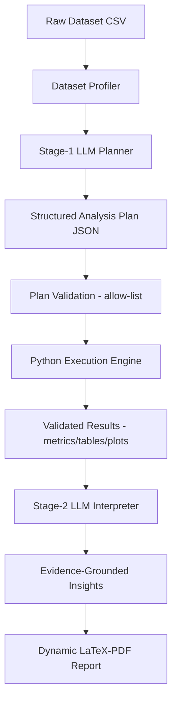

# Autonomous Ops Analytics

**LLM-Orchestrated Autonomous Data Science & Dynamic Reporting System**

A two-stage LLM pipeline that plans the right analysis for an unfamiliar dataset, executes it deterministically in Python, interprets the computed evidence, and assembles an adaptive professional report.

> **LLM plans → Python computes → LLM interprets → Report engine communicates**

The LLM is the reasoning/orchestration layer. Numerical computation (statistics, model training, metrics) is always performed locally by the Python/ML engine — never by the LLM.

## Key Features

- **Stage-1 LLM planner** — selects preprocessing, EDA, statistics, supervised/unsupervised strategy, algorithms, metrics, and visualizations from the dataset profile
- **Deterministic execution engine** — cleaning, feature engineering, correlation, clustering (KMeans), anomaly detection (IsolationForest), naive forecasting backtest, supervised classification/regression, matplotlib figures
- **Plan validation layer** — declarative JSON plans checked against a method allow-list; no `exec`/`eval` of LLM output
- **Stage-2 LLM interpreter** — evidence-grounded findings, recommendations, and limitations from computed results
- **Dynamic LaTeX/PDF reports** — sections adapt to what the data actually supported
- **Three execution modes** — `off` (deterministic), `api` (Gemini REST), `browser` (Selenium, experimental)
- **Reproducible artifacts** — `profile.json`, `gemini_plan.json`, `manifest.json`, tables, figures, saved pipelines

## How It Works



**Stage 1 — plan:** profile (shape, dtypes, missingness, timestamp detection) + method catalog → LLM returns a JSON plan → validated → executed.
**Stage 2 — interpret:** computed metrics/tables/plot inventory → LLM (or offline template fallback) writes executive summary, findings, recommendations, limitations.

## Example Output

See [`sample/`](sample/) for a runnable synthetic demo:

- `sample/sample_data.csv` — 200-row sensor-like dataset
- `sample/sample_outputs/` — profile, plan, metrics, selected figures, `.tex` report (PDF builds when LaTeX is installed)

```bash
python ops_pipeline_auto.py sample/sample_data.csv --out outputs --gemini-mode off
```

## Execution Modes

| Mode | Flag | Credentials | Stability |
|---|---|---|---|
| Offline / deterministic | `--gemini-mode off` | none | stable, CI-safe |
| Gemini API | `--gemini-mode api` | `gemini_api_key.txt` or `GEMINI_API_KEY` | stable programmatic path |
| Gemini browser | `--gemini-mode browser` | interactive login | experimental, UI-dependent |

Browser-based integration is a cost-conscious experimentation path during development; API-based integration is the conventional programmatic path. Browser automation depends on the external web UI, may break without notice, and should be used per applicable service terms. Details: [`docs/LLM_INTEGRATION.md`](docs/LLM_INTEGRATION.md).

## Quick Start

```bash
pip install -r requirements.txt        # core: numpy, pandas, matplotlib, requests
pip install -r requirements-optional.txt  # recommended: scikit-learn, joblib, selenium, ...

# Offline (no key, no browser)
python ops_pipeline_auto.py ./data.csv --out outputs --gemini-mode off

# With a supervised target
python ops_pipeline_auto.py ./data.csv --out outputs --gemini-mode off --target fault

# Gemini API
python ops_pipeline_auto.py ./data.csv --out outputs --gemini-mode api --gemini-model gemini-2.5-flash
```

Outputs land in `outputs/<RUN_ID>/` — see [`docs/OUTPUTS.md`](docs/OUTPUTS.md). `manifest.json` is the automation hook.

## Repository Structure

```
ops_pipeline_auto.py      # main entry point (single-script pipeline)
sample/                   # synthetic demo dataset + committed small outputs
tests/                    # offline tests (mocked LLM, no browser, no key)
docs/                     # methodology, architecture, LLM integration, outputs, config
examples/                 # run_offline.sh / run_gemini_api.sh / run_gemini_browser.sh
.github/workflows/        # CI: install, smoke-test offline pipeline, run tests
```

## Documentation

- [Methodology](docs/METHODOLOGY.md) — full Stage 0/1/2 + execution + reporting procedure
- [Architecture](docs/ARCHITECTURE.md) — modules, data/control flow, extension points
- [LLM Integration](docs/LLM_INTEGRATION.md) — prompts, modes, fallbacks, security
- [Configuration](docs/CONFIG.md) — flags, env vars, big-mode guardrails
- [Outputs](docs/OUTPUTS.md) — artifact inventory

## Tech Stack

Python · pandas · NumPy · scikit-learn (optional, guarded) · matplotlib · Gemini REST API · Selenium (browser mode, optional) · LaTeX (best-effort PDF) · GitHub Actions

## Limitations

- LLM output is constrained to a validated JSON plan and evidence-grounded narrative; review findings with domain context.
- Forecasting is a naive backtest baseline, not a production forecaster (see `docs/METHODOLOGY.md`).
- Browser mode is experimental and UI-dependent.
- PDF requires a LaTeX engine; otherwise the `.tex` report is still generated.
- Designed for multi-LLM extensibility; only Gemini API/browser + offline paths are implemented.
