# Architecture

Single-script entry point by design: `ops_pipeline_auto.py`. Everything is importable
(no side effects on import) so tests can call functions directly.

```mermaid
flowchart LR
    CLI[CLI - argparse] --> ING[Ingestion - load_csv / normalize]
    ING --> PROF[Profiler - profile_dataframe]
    PROF --> P1[Stage-1 Planner - obtain_stage1_plan]
    P1 --> VAL[Plan Validation - validate_plan]
    VAL --> CLEAN[Cleaning - clean_dataframe]
    CLEAN --> FEAT[Feature Engineering]
    FEAT --> AN[Analyses - correlation / clustering / anomaly / forecast / supervised]
    AN --> VIZ[Visualization - make_plots]
    VIZ --> P2[Stage-2 Interpreter - obtain_stage2_sections]
    P2 --> REP[Report Engine - build_latex / compile_pdf]
    REP --> MAN[Manifest + pipeline.log]
```

## Components

| Component | Function(s) | Notes |
|---|---|---|
| CLI | `parse_args`, `main` | `--gemini-mode`, `--target`, `--out`, `--run-id`, `--no-plots` |
| Dataset profiler | `should_big_mode`, `load_csv`, `normalize_columns`, `detect_timestamp`, `profile_dataframe` | Big-mode sampling via `OPS_BIGMODE_*` env vars |
| Configuration | `env_int`, env reads | `OPS_MAX_CORR_COLS`, `OPS_CLUSTER_MAX_FIT_ROWS`, `GEMINI_*` |
| LLM interface | `gemini_api_generate`, `gemini_browser_generate`, `extract_json_object` | REST via stdlib `urllib`; Selenium lazily imported |
| Stage-1 planner | `build_stage1_prompt`, `build_default_plan`, `obtain_stage1_plan` | Offline default; API/browser with fallback |
| Plan validation | `validate_plan`, `METHOD_CATALOG`, `ALLOWED_TOP_KEYS` | Allow-list, per-field fallback, no exec/eval |
| Preprocessing | `clean_dataframe`, `engineer_features` | Median/mode, ffill/bfill, IQR clip, time/lag/rolling |
| EDA / statistics | `run_correlation` | Guard-railed matrix, `tables/correlation.csv` |
| Supervised ML | `run_supervised` | sklearn guarded; joblib pipeline persisted |
| Unsupervised ML | `run_clustering` | KMeans + scaler, sampled fit |
| Anomaly detection | `run_anomaly` | IsolationForest, z-score fallback |
| Forecasting | `run_forecast` | Naive backtest MAE/RMSE |
| Visualization | `make_plots` | Matplotlib Agg; plan-gated |
| Stage-2 interpreter | `deterministic_sections`, `obtain_stage2_sections` | Template fallback always available |
| Reporting | `build_latex`, `compile_pdf`, `latex_escape` | Always `.tex`; `.pdf` best-effort |
| Run management | run dir layout, `manifest.json`, `pipeline.log` | `manifest.json` is the automation hook |

## Data / control flow

1. `main` creates `outputs/<RUN_ID>/{reports,figures,tables,models}` and file+stream logging.
2. CSV → DataFrame → profile written to `profile.json`.
3. Plan obtained per `--gemini-mode`, validated, written to `gemini_plan.json` with `source` + `warnings`.
4. Plan drives cleaning → features → selected analyses → plots.
5. Results + profile → Stage-2 sections → `gemini_stage2_sections.json` with `source`.
6. Profile + plan + results + sections + figure list → `.tex` → best-effort `.pdf` → `manifest.json`.

Failed or skipped modules record `{"status": "skipped"|"failed", "reason": ...}` instead of
raising, so the report always reflects what actually ran.

## Extension points

Split into a package later without changing behavior:

- `io.py` — ingestion, typing, timestamp inference
- `profile.py` — profiler + big-mode strategy
- `analysis/*.py` — correlation, clustering, anomaly, forecast, supervised
- `reporting/*.py` — LaTeX builder, figure/table helpers
- `llm/*.py` — Gemini API/browser clients, plan/section validators
